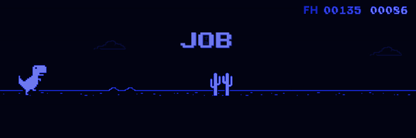

.

<!-- ********* Line ********* -->

.

<!-- **** FH GIF ****-->

  

.

<!-- ********* Line ********* -->

<h1 align="center"> Hello there...</h1>

  
  

    👍 I'm Fabricio, a web designer, I really like design and bringing code to life. 👍
  

  

    💻 I have a front end profile but with knowledge of the back end due to my full stack certification.  💻
  

  

    📂 Here you can see repositories of practical work, courses and freelance jobs... Welcome. 📂
  

<!-- ********* Line ********* -->

.

<!-- ********* Title ********* -->

<h2>This says the octocat of my repos:</h2>

.

<!-- ********* Stats ********* -->

  

<!-- ***** Contributions ***** -->
  

<!-- ********* Graph ********* -->

.

<!-- ********* Line ********* -->

.

<!-- ****** Langueges ****** -->
<h2>This is how it was spoken in the projects:</h2>

.

  
  

    
    
    
    
    
    
  

  

.

<!-- ********* Line ********* -->

.

<!-- ****** F_T_Rex ****** -->
<!-- **In Dark/Light mode** -->

  <picture>
    <source width="60%" media="(prefers-color-scheme: dark)" src="assets/fa_t-rex_blue.gif">
    <source width="60%" media="(prefers-color-scheme: light)" src="assets/fa_t-rex_white.gif">
    
  </picture>

.

<!-- ********* FBtns ********* -->

  
  
  
  

